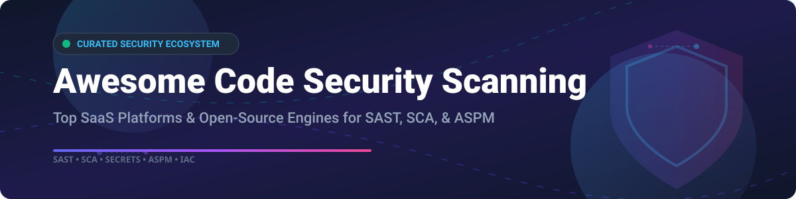

# 🛡️ Awesome Code Security Scanning

  
  
  
  
  

## 🚀 Top Code Security Scanning Platforms Ecosystem

**Curated List of SaaS Products & Open-Source GitHub Projects**

*Focused on SAST, SCA, Secrets Detection, IaC Security & Application Security Posture Management (ASPM)*

**Last updated: September 2026**

---

This repository tracks notable **SaaS platforms** and **open-source projects** for **Code Security Scanning**. These tools help developers, AppSec specialists, and DevSecOps teams identify vulnerabilities in first-party code (SAST), detect vulnerable open-source dependencies (SCA), find hardcoded secrets, scan Infrastructure as Code (IaC), and manage application security posture (ASPM) across the SDLC.

---

## 📑 Table of Contents

- [🏢 SaaS/Hosted Platforms](#-saashosted-platforms)
- [🔓 Open-Source GitHub Projects](#-open-source-github-projects)
- [🤝 How to Contribute](#-how-to-contribute)
- [☕ Support](#-support)
- [📈 Star History](#-star-history)
- [⚠️ Disclaimer](#%EF%B8%8F-disclaimer)

---

## 🏢 SaaS/Hosted Platforms

> 📊 **Market Overview**: The global Application Security (AppSec) & Code Security Scanning market is estimated at **$6.2 Billion - $7.8 Billion (2025/2026)** with a CAGR of 18.5%. The market is **moderately fragmented**, featuring established enterprise legacy leaders (Checkmarx, Veracode) alongside fast-growing developer-first innovators (Snyk, Semgrep) and emerging ASPM consolidators (Apiiro, OX Security, ArmorCode).

*Sorted by Company Size / Revenue / Valuation (Descending)*

| Platform | Estimated Valuation / Revenue | Starting Paid Tier Pricing | Free Tier / Trial Limits | Core Focus & Features |
| :--- | :--- | :--- | :--- | :--- |
| **[Checkmarx](https://checkmarx.com/)** | **~$1.4B** Valuation (acquired by Hellman & Friedman for $1.15B) | ~$12,000 / year (Enterprise AppSec contract) | 14-Day Free Trial (Full feature access upon request) | Enterprise SAST with Checkmarx Fusion hybrid query & AI engine, SCA, reachability analysis, and AI Triage. |
| **[Veracode](https://www.veracode.com/)** | **~$1.2B - $1.4B** Valuation (acquired by TA Associates) | ~$10,000 / year (Enterprise SaaS license) | 14-Day Free Trial (Binary & static scan evaluation) | Binary static analysis, SCA, and Mobile Behavioral Analysis reviewing app permission risks. |
| **[Snyk](https://snyk.io/)** | **~$7.4B** Valuation ($250M+ ARR) | $25 / developer / month (Team plan) | **Free Forever**: 300 Code tests/mo, 200 License tests/mo | Developer-first SAST (Snyk Code), SCA, container, and IaC scanning with real-time IDE extensions. |
| **[SonarQube](https://www.sonarsource.com/)** | **~$4.7B** Valuation ($150M+ ARR) | $15 / month (SonarQube Cloud Developer Plan) | **Free Community Edition** (Self-hosted, unlimited LOC for open source & core languages) | Code quality & security platform with 5,000+ SAST rules across 30+ languages and CI/CD quality gates. |
| **[Mend.io](https://www.mend.io/)** | **~$600M** Valuation ($80M+ ARR) | ~$5,000 / year (Enterprise base subscription) | 30-Day Free Trial (Full SCA & SAST capabilities) | Enterprise SCA prioritization, reachability analysis, malicious package detection, and SBOM generation (SPDX/CycloneDX/VEX). |
| **[GitGuardian](https://www.gitguardian.com/)** | **~$300M** Valuation ($25M+ ARR) | $13.50 / developer / month (Pro plan) | **Free Forever**: Up to 25 developers (Unlimited public/private repo secrets scanning) | Automated secrets detection, historical git commit scanning, and automated incident remediation workflows. |
| **[Semgrep](https://semgrep.dev/)** | **~$250M** Valuation (Series C funded) | $28 / contributor / month (Semgrep Pro) | **Free Forever**: Up to 10 contributors (Full SAST & SCA features) | Ultra-fast SAST, SCA, and Secrets detection engine with custom rule syntax, AI IDOR detection, and IDE plugins. |
| **[Apiiro](https://apiiro.com/)** | **~$200M** Valuation (Series B funded) | ~$25,000 / year (Enterprise ASPM subscription) | 14-Day Free Trial (Enterprise proof-of-concept evaluation) | Agentic ASPM platform with AutoFix AI Agent connecting runtime insights with code-level risk triage. |
| **[ArmorCode](https://www.armorcode.com/)** | **~$150M** Valuation (Series B funded) | ~$20,000 / year (Enterprise ASPM platform license) | 14-Day Free Trial (Interactive demo & POC access) | AI-powered ASPM consolidating 285+ AppSec tools with Anya agentic AI for automated risk remediation. |
| **[OX Security](https://www.ox.security/)** | **~$100M** Valuation (Series A funded) | ~$15,000 / year (Enterprise ASPM license) | 14-Day Free Trial (Pipeline risk evaluation) | Pipeline security & ASPM focusing on root-cause consolidation, evidence-based prioritization, and no-code remediation. |

---

## 🔓 Open-Source GitHub Projects

*Sorted by GitHub Star Count (Descending)*

| Project | GitHub Stars | License | Description |
| :--- | :--- | :--- | :--- |
| **[TruffleHog](https://github.com/trufflesecurity/trufflehog)** |  | AGPL-3.0 | High-performance secrets scanner searching for 800+ credential types, API keys, and tokens in git repos, filesystems, and S3 buckets with active verification. |
| **[Semgrep CE](https://github.com/semgrep/semgrep)** |  | LGPL-2.1 | Fast open-source static analysis engine for searching code, enforcing coding standards, and finding security bugs using lightweight, polyglot pattern rules. |
| **[Gitleaks](https://github.com/gitleaks/gitleaks)** |  | MIT | SAST tool for detecting and preventing hardcoded secrets like passwords, api keys, and tokens in git repositories and CI/CD pipelines. |
| **[Checkov](https://github.com/bridgecrewio/checkov)** |  | Apache-2.0 | Static code analysis tool for Infrastructure as Code (IaC) scanning Terraform, CloudFormation, Kubernetes, Dockerfile, Serverless, and ARM templates. |
| **[Trivy](https://github.com/aquasecurity/trivy)** |  | Apache-2.0 | Comprehensive security scanner for container images, filesystems, git repos, SBOMs, vulnerabilities (SCA), misconfigurations (IaC), and secrets. |
| **[Syft](https://github.com/anchore/syft)** |  | Apache-2.0 | CLI tool and Go library for generating Software Bill of Materials (SBOM) from container images and filesystems in SPDX, CycloneDX, and Syft formats. |
| **[Grype](https://github.com/anchore/grype)** |  | Apache-2.0 | Vulnerability scanner for container images and filesystems. Works seamlessly with Syft SBOM formats to identify CVEs across OS and language packages. |
| **[KICS](https://github.com/Checkmarx/kics)** |  | Apache-2.0 | Keeping Infrastructure as Code Secure (KICS) detects security vulnerabilities, compliance issues, and infrastructure misconfigurations in Terraform, K8s, Docker. |
| **[OSV-SCALIBR](https://github.com/google/osv-scalibr)** |  | Apache-2.0 | Google's open-source software inventory extraction and security finding detection library for container, filesystem, and repo SCA scanning. |
| **[argus](https://github.com/argus-ffi/argus)** |  | MIT | High-performance Rust secrets scanner with advanced heuristics including Sink Provenance, Leak Velocity, Credential Shadowing, and WASM support. |

---

## 🛠️ Recommended DevSecOps Security Stack Architectures

To build a zero-cost, enterprise-grade open-source security scanning pipeline in CI/CD:

1. 🔍 **SAST (Static Application Security Testing)**: Use **Semgrep CE** for custom policy enforcement and fast semantic code scanning.
2. 🔑 **Secrets Detection**: Combine **TruffleHog** and **Gitleaks** with pre-commit hooks to block exposed API keys and tokens.
3. 📦 **SCA & SBOM**: Use **Syft** for SBOM generation and **Grype** or **OSV-SCALIBR** for open-source vulnerability scanning.
4. 🏗️ **IaC Security**: Deploy **Checkov** or **KICS** in GitHub Actions / GitLab CI to catch cloud misconfigurations before deployment.

---

## 🤝 How to Contribute

Contributions are always welcome! 

1. 🍴 Fork the repository.
2. 📝 Add or update tools in `README.md` following the table layout and formatting.
3. 🔗 Verify all links, pricing details, and star badges.
4. 📬 Submit a Pull Request with a clear description of changes.

---

## ☕ Support

If you find this curated list helpful for your AppSec workflows, security auditing, or DevSecOps pipeline setup, please consider supporting the project:

- ⭐ **Star this repository** to help others discover it!
- 🔀 **Fork & Share** it with your team and DevSecOps community.
- ☕ **Buy me a coffee**: Support ongoing open-source maintenance via the [Sponsor Dashboard](https://github.com/sponsors/ishandutta2007).

Thank you for supporting open-source security tooling! ❤️

---

## 📈 Star History

---

## ⚠️ Disclaimer

- This is a **community-curated** list for informational and research purposes.
- Tools listed handle sensitive codebase security details; ensure proper access permissions and encryption for scan results.
- For curated collections of awesome projects, check out [Awesome-Awesome-Awesome](https://github.com/ishandutta2007/Awesome-Awesome-Awesome).

---

  <b>Made with ❤️ for Security Engineers, AppSec Specialists, and DevSecOps Practitioners worldwide.</b>

